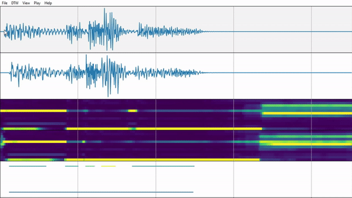
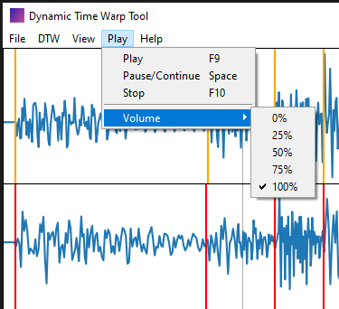

# DTW App
This app has the sole purpose of aligning midi files with audio files. 
In the first step, a dynamic time warp algorithm is applied to warp the time series of the midi file to match the time series of the audio. 
In the second step, you can manually adjust the potential inconsistencies using visual cues, which include:
- wave plot for both audio tracks (original audio + midi generated audio)
- extracted chroma features for both audio tracks on a twelve note scale, the color indicates the likelihood 
- midi plot, the color indicates the velocity of each note

Via drag and drop you can manually shift the time series of the midi file. 
When done, simply export the midi file.

## Installation
- requires a 64-bit version of Python 3 
- install all requirements listed in the ``requirements.txt``
- you need `ffmpeg.exe` on PATH
- run the `app.py` file

## Example of a finished project
Description of the 5 plots:
- Plot 1: wave plot of the (imported) audio we want to align the midi to
- Plot 2: wave plot of the (imported) audio that was generated from the midi file
- Plot 3: chroma feature plot of plot 1 (automatically estimated when loading the audio file)
- Plot 4: chroma feature plot of plot 2 (automatically estimated when loading the audio file)
- Plot 5: midi plot of the (imported) midi file

## Walkthrough

### Step 1
Load the following 3 files:
- audio file you want to align the midi
- audio file that you generated from the midi
- midi file (with 1 track only & 120 BPM 4/4)

Note 1: Instead of .mp3 you can also use .wav files. 
Note 2: If your midi file has more tracks, delete the remaining tracks or merge them to a single track with another software, e.g. using MidiEditor (available for free: https://www.midieditor.org/). 
Note 3: If your midi has a different tempo than 120 BPM 4/4, then:
1) open the dtw-app and import the original audio and the midi 
2) adjust the length of the midi so that it matches the original audio 
3) export the midi 
4) restart the dtw-app 
5) import the originial audio, the new midi and the new audio generated from the new midi.

When loading the audio files, the chroma features are computed simultaneously. 
The computation may take a minute depending on the length of the song and will freeze the app during that time.

The wave plots only show every 100th data point, which improves the performance of loading data, updating the graph and computing the dtw tremendously, at the cost of having a slightly less accurate graph. 
You can adjust this by changing the `downsampling_factor_1` and `downsampling_factor_2` variables inside the `app.py` code.

### Step 2
Once all 3 files were successfully loaded, go ahead and apply the dtw algorithm. 
It will take a minute to complete. For good results, the midi and original audio should have approximately the same length (+/- 15%). 
Once it is completed, plots 2, 4 and 5, which together represent the midi, will show updated data. 
It should now be more closely aligned to plots 1 and 3, which represent the audio we want the midi to be aligned to.

### Step 3
After applying the dtw algorithm, it is now time manually adjust the result. 
The controls shown in the tab below allow you to continuously zoom in or out on the x-axis, and to move the visible range to the left or right. 
A simple (left) mouse click inside one of the plots will generate a bar, a right click will remove it. 
Plots 2, 4, and 5 are linked, meaning that generating a bar in one of those plots will also create a bar in the other two. 
The same is true for plot 1 and 3. 
Now you can drag and drop the bars as you wish. 
It will only warp the content inside the boundaries of the closest bar to the left and right. 
If there is no bar on either side, the limits of the track are used instead.

When done, you can export the midi. 
There is also an option to save the current project, but the project file will be approximately as big as the joint size of all imported files. 
Therefore, it is recommended to only save the project when planning to continue working on it at a later point in time.

### Other Options
You can also play back .mp3 files and 16-bit .wav files (the standard for wav files). 
A green bar will show the current position, and the view is updated automatically to keep the cursor on the screen. 
Pressing `b` while the track is playing will insert a bar in plot 1 and 3.

For more information on the inner workings of dtw, check out: 
https://www.audiolabs-erlangen.de/resources/MIR/FMP/C3/C3S2_DTWbasic.html

as well as: 
https://librosa.org/doc/latest/index.html

